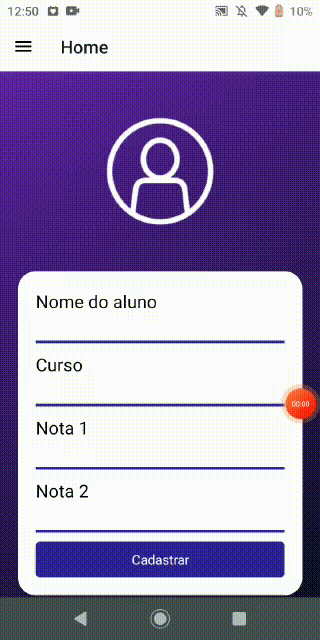

# Cadastro de aluno
Este foi um pequeno projeto passado como tarefa no curso de programação mobile da Etec. O objetivo deste projeto é passar informaçãoes de uma tela para outra, no caso o nome, o curso e as notas. 

## Tecnologias
>
Aqui está as tecnologias usadas no projeto

 - Expo 45.0.0
 - React navigation drawer 6.4.3
 
 ## Serviços usados
  
  - Github

## Como usar
A pasta apk contém o apk da aplicação para que possam testar em seus celulares

## Funcionalidades

As principais funcionalidades são:
 - Transportar informações passados pelo usuário para outra tela através de useState

## Links
 - Repositório: https://github.com/Vinicius-B-Leite/AppCadastro
 - Em casos de bugs, por favor me contate
  viniciusbleite21@gmail.com

## Versão
 1.0.0

## Autor
Feito com <3 por Vinicius B. Leite